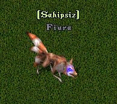

# Fiura

STR : 4250 - DEX : 2000 - ARM : 350\
Sadece Mother Ostard ve Market sisteminden elde edilir.\
Özellik: \* .binekbonus\* komutu ile 'Clone of Fiura' bonusunu kullanarak kendini klonlar ve ortalardan belirli bir süre yavaş adımlarla kaybolur. Rakiplerinin dikkatini başka yöne çektikten sonra hiçbirşey olmamış gibi yoluna devam eder.\
Atak verdiği rakibine 'Attack of Tail' bonusu ile kuyruğuna yapışmış sinekleri göndererek belirli bir süre boyunca her saniye başı 5-7 arası hpsinin düşmesine sebebiyet verir.
